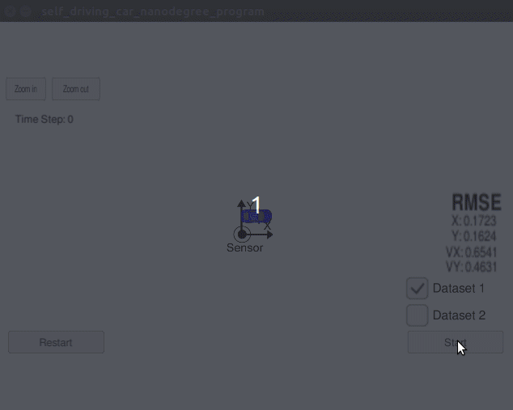
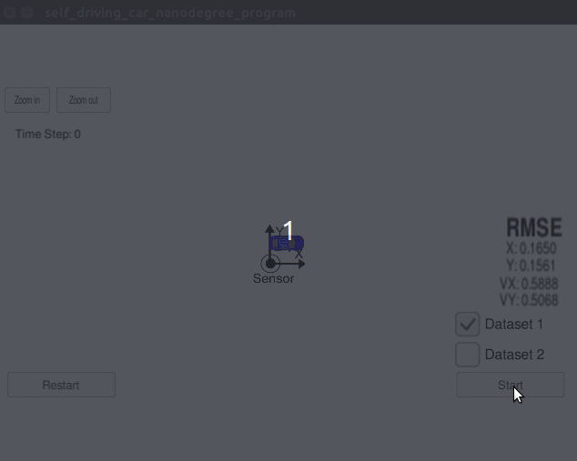
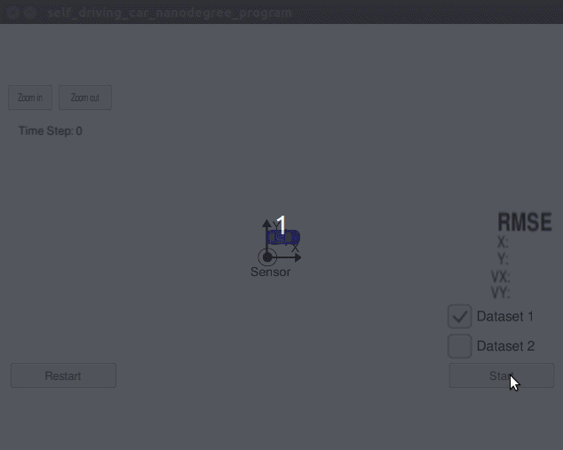

# Extended Kalman Filter Project (Sensor Fusion)

## 1.0 Make & Run Project (Linux)
Download the simulator for term 2 [HERE](https://github.com/udacity/self-driving-car-sim/releases/). From the main repository folder compile the code using make and run the project to ensure there were no build errors.

	$ chmod +x install-ubuntu.sh`
	$ /install-unbuntu.sh
	$ mkdir build && cd build
	$ cmake .. && make
	
If there are no build errors then run the simulator (client) and the Extended Kalman Filter (server) file from the build folder in the project repository. The two programs talk to one another through the uWebSockets on local port 4567.

	$ # From the simulator folder.
	$ ./term2_sim.x86_64
	$ # From the project folder.
	$ ./build/ExtendedKF

From the terminal you should see "Listening to port 4567" until you connect and start the Udacity Simulator. If the connection is successful you should see "Connected!!!" followed by a print out of values.

## 2.0 Complete the Project Classes
### 2.1 Tools.cpp
...

### 2.2 FusionEKF.cpp
... must set time on initial measurement else OVF will occur with radar first

### 2.3 Kalman_Filter.cpp
...

## 3.0 Running the Simulator
### 3.1 Laser Data Only

 

### 3.2 Radar Data Only

 

### 3.3 Sensor Fusion (Both)

 

RMSE [X, Y, VX, VY]
Run #1 (Data 1): 0.0974, 0.0855, 0.4517, 0.4404 (ALL)
Run #2 (Data 2): 0.0726, 0.0965, 0.4219, 0.4937 (ALL)
Run #3 (Data 1): 0.1840, 0.1543, 0.6056, 0.4861 (LASER)
Run #4 (Data 2): 0.1650, 0.1561, 0.5888, 0.5068 (LASER)
Run #5 (Data 1): 0.2318, 0.2985, 0.5943, 0.5848 (RADAR)
Run #6 (Data 2): 0.2440, 0.3379, 0.6039, 0.8182 (RADAR)
